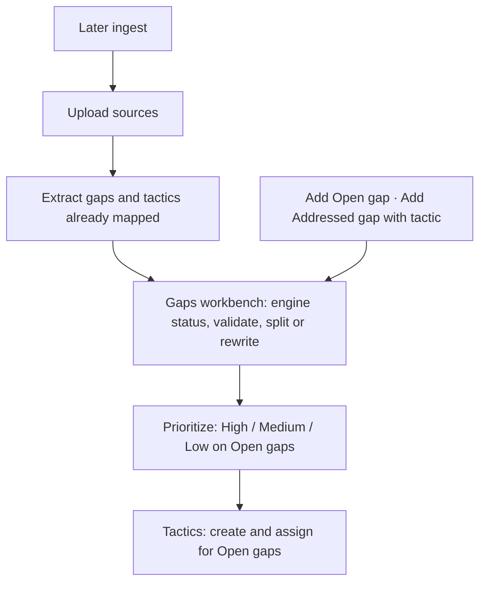
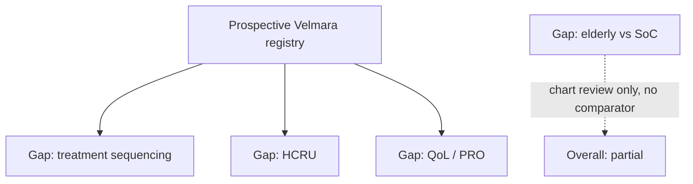

# Synapse IEGP: problem statement and proposed solution

Status: v1 product paper for the digital **Integrated Evidence Generation Plan (IEGP)**. Locked model: [`iegp-model.md`](iegp-model.md). Historical CIR/theme SDLC pack remains under [`sdlc/`](sdlc/) as design lineage, not the live system of record.

Demo corpus is fictional (Velmara / velmaratinib). No real patient or payer data.

---

## 1. Problem statement

Cross-functional pharmaceutical teams (Clinical Development, Medical Affairs, HEOR, RWE, Market Access, Regulatory, Commercial, affiliates, KOLs, payers, HTA) must answer:

**What does the organisation need to know, why, what evidence already exists or is being generated, what remains unresolved, which residual needs matter most, and what should be done about them?**

Today that work lives in static gap spreadsheets, study trackers, and slideware. Those tools fail in the same ways Synapse already refused for insights:

- A stakeholder quote (“we don’t have enough evidence in elderly patients”) is treated as a **validated gap** instead of a **candidate need**.
- A tactic that **exists** (a chart review, a publication, a registry) is treated as a gap that is **closed**.
- One registry that collects treatment, OS, HCRU and PROs is copied onto four gap rows, or forced into a single theme.
- When coverage is partial, teams overwrite the original gap instead of keeping a residual with an audit trail.
- Coverage is confused with **priority**. An 80%-covered HTA question can still be the most important residual; a 10%-covered curiosity is not.

The unit of work is not a document, a study, or a cluster. It is an **atomic evidence need**, joined onto a named **gap**, mapped to **tactics** with dimensional coverage, leaving a **residual** that can be prioritised onto a **roadmap**.

---

## 2. What we refuse (Synapse principles, IEGP objects)

| Refusal | IEGP consequence |
| --- | --- |
| Nested document trees as the store | Needs, gaps, tactics, coverages are flat rows plus joins. |
| Embedding clusters as the catalog | Gaps are named decision objects a TA lead can brief. IDs do not drift. |
| Copying the sentence onto every gap or tactic | `need_gap_links` and `coverages` store IDs. The statement lives once. |
| Auto-naming / auto-closing | Humans lock every gate. Engine drafts; it does not write Addressed. |
| Overwriting the parent when residual | Original gap remains. Residual is a child. |
| “A tactic exists” = “the gap is closed” | Ten coverage dimensions + overall degree. |
| Coverage = priority | Separate locked band on the residual. Effort/cost sit on the tactic. |
| Publications as non-objects | Generation and dissemination are both tactics; dissemination can be `not_relevant` for coverage. |

---

## 3. Proposed solution

Synapse IEGP is a **dynamic evidence-planning system**:

Strategic objectives → sources → extracted gaps + tactics already mapped → **Gaps** (engine status, human validation, split/rewrite) → **Prioritize** → **Tactics** for open gaps.

### IEGP process (Upload → Gaps → Prioritize → Tactics)

Gaps is the combined mapped + status workbench. There is no Review / Mappings wizard step and no candidate accept/reject inbox. Gap cards show an evidence-topic title once. Partial cannot stay: split LEFT = Addressed + tactic, RIGHT = Open leftover, or rewrite the original as Open or Addressed. The original is retired into version history. Gantt / gates timeline is parked (docs only).

Gap status is **computed**: **Open** (no completed/ongoing/planned tactics and no published literature; proposed does not count), **Partially Addressed** (some evidence, residual leftover — must split or rewrite), or **Addressed** (evidence sufficient to fully close). Humans validate every live gap before Prioritize. Click Open or Addressed to override with a reason. Override wins until cleared or marked stale on ingest/coverage refresh (disagreement is shown; the engine does not silent-clobber). Plan High / Medium / Low remain priority bands, not those statuses.

### Traceability

Source → candidate need → gap → associated tactics → coverage → residual → priority → proposed tactic → owner/timing → roadmap.

### Candidate vs gap

Interview: “We don’t have enough evidence in elderly patients.”

The system extracts a **candidate evidence need** and a **live gap** already mapped to extracted tactics, with engine-computed status. It does not dump a residual paragraph onto the card and does not present an accept/reject inbox. Pressure-test is a backend engine: when extracted tactics only partially cover the parent, Gaps shows **Partially Addressed**. The user must split or rewrite before Prioritize. Click Open or Addressed to override with a reason.

### Worked mapping (Velmara seed)

Gap: comparative effectiveness of velmaratinib vs regional SoC in elderly advanced EGFR-mutant NSCLC.

Tactic: retrospective RWE in patients aged ≥65, no comparator.

| Dimension | Assessment |
| --- | --- |
| Population | Yes |
| Intervention | Yes |
| Comparator | No |
| Outcomes | Yes |
| Comparative effectiveness / decision utility | No |
| **Overall** | **Partial** |

Residual (parent retired into version history; leftover is a **new Open gap** after split): comparative outcomes versus relevant regional SoC.

Priority: human-locked High (HTA decision date, uncovered comparator). The engine does not propose a band.

### One tactic, several gaps

The prospective Velmara registry maps to sequencing, HCRU and QoL. That synergy is visible because membership is a join, not a copy.

### Priority (locked)

Humans lock High / Medium / Low. The engine does not assign a band. Effort and cost live on the tactic. Engine never places a residual on the roadmap.

### Refresh

Living plan. Tactic status change or ingest marks coverage outdated for review. Residuals stay open for a human to reassess. Nothing auto-closes.

---

## 4. v1 slice

Shipped on Postgres with a rich Velmara seed (objectives, interviews, TLR, CDP/HEOR/RWE sources, 20+ needs, 12 gaps, 12 tactics, dimensional mappings, residuals, priorities, forward roadmap).

Not in v1: login, AI tactic ideation, multi-asset/franchise overlays, annual snapshots, embedding catalog.

Run: `npm install && npm test && npm run dev` after Postgres (`DATABASE_URL`). App: [http://127.0.0.1:43217](http://127.0.0.1:43217).
