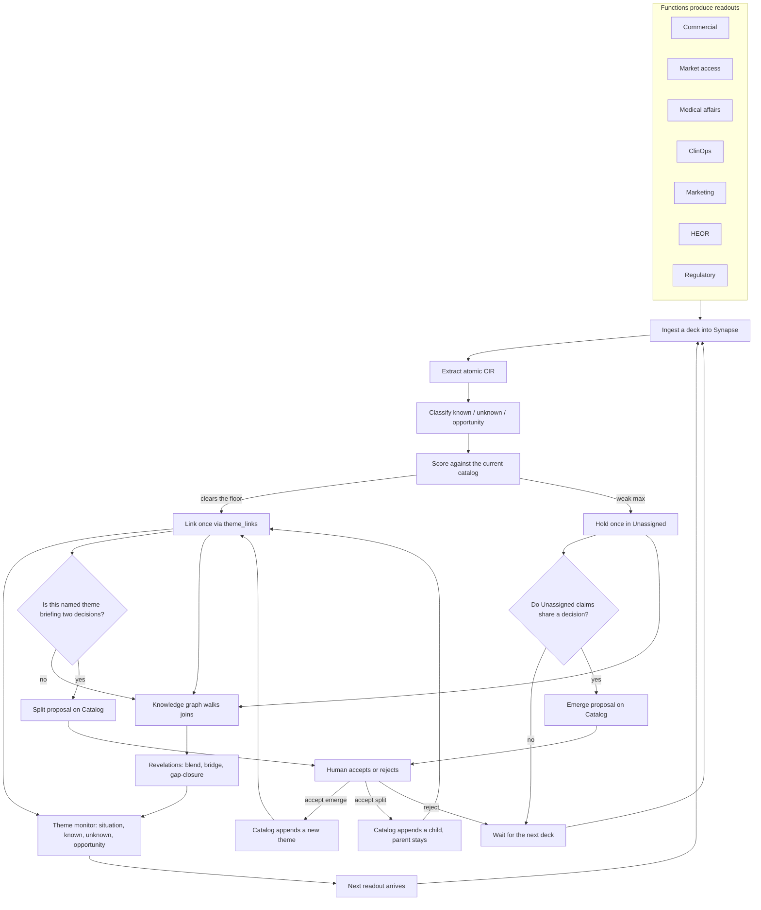
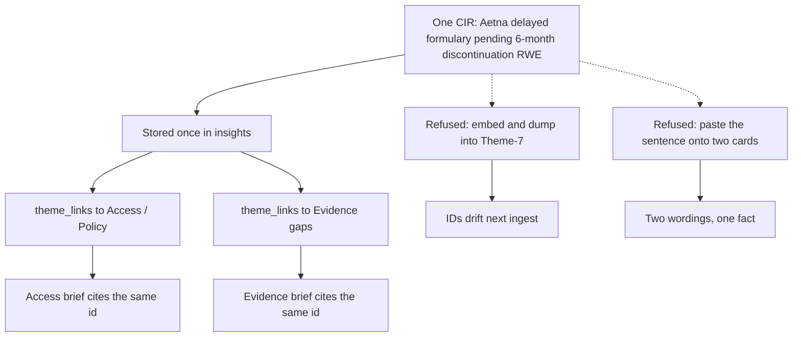
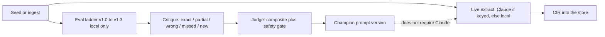

# Synapse: problem statement and proposed solution

Status: v1 product paper. Spec IDs and tests live in [`docs/sdlc/`](sdlc/). This document is the narrative: what is broken in the brand-insights loop, why the obvious ML shortcuts fail, and what Synapse actually builds instead.

Demo corpus is fictional (Velmara / velmaratinib). No real patient or payer data.

---

## 1. Problem statement

### 1.1 Who this is for

A commercial brand team in biopharma does not live in one function. In a typical quarter the same asset produces:

| Function | Artifact | What leadership asks |
| --- | --- | --- |
| Commercial | Brand plan PPTX | Share, competitive, site of care |
| Market access | Payer ad board PPTX | Formulary, IRA, step edits |
| Medical affairs | KOL Word memo | Sequencing, CNS, safety |
| Clin ops | Enrollment XLSX | Sites, diversity, protocol pressure |
| Marketing | Campaign readout PPTX | Recall, spend, message gaps |
| HEOR | ICER / BIM pack XLSX | Cost-effectiveness, budget impact |
| Regulatory | FDA interaction log DOCX | Clock, CMC, labeling, REMS |

The analyst’s job is not “summarize the decks.” It is to extract **discrete insights**, group them into **themes the brand can brief against**, and tell leadership three things:

1. **What we know** (supported facts, with sources).
2. **What we don’t** (explicit gaps, unmeasured quantities).
3. **What we should do next** (concrete actions that close a gap).

That loop is still mostly a human with a slide deck: copy a bullet, paste it onto a theme slide, hope the same finding is not sitting in three colors on three functions’ cards.

### 1.2 The unit of work is wrong

Office files are **sources**. They are not knowledge.

A slide is a container. A Word heading is a container. A spreadsheet cell is a container. The thing an analyst actually files is a **claim**: one sentence that can be true, false, unknown, or an action, with a verbatim quote and a location.

When the system of record is the file (or a nested “document → slides → bullets” JSON tree), three jobs become hostile:

- **Clustering** has to walk a tree instead of iterating claims.
- **Gold matching** (did we recover this insight?) has to reconstruct the same tree.
- **Multi-theme membership** has nowhere to live. “Aetna delayed formulary pending 6-month discontinuation RWE” is Access **and** Evidence. A tree forces a parent. A copy-paste workflow duplicates the sentence.

The product failure mode is familiar: two theme cards, two slightly different wordings, one underlying fact. Next quarter nobody knows which version to trust.

### 1.3 Themes are decision objects, not latent blobs

Brand themes are names a VP will say in a room: Access / Policy, Evidence gaps, Competitive, Safety, Launch operations. They are **stable decision objects**.

They are not “whatever the embedding clustered this week.”

That distinction is the whole problem. Unsupervised semantic clustering (embed every bullet, k-means / HDBSCAN, name the blob) looks like automation and produces four failures this workflow cannot absorb:

1. **Decision distance ≠ embedding distance.** “IRA net price” and “Horizon outcomes contract” are semantically far. Both belong under Access / Policy. The clusterer will split them or mash them with something else.
2. **One claim, two decisions.** Unsupervised clustering assigns a point to one cluster, or you duplicate the row. Duplication is how insights turn back into slideware.
3. **IDs drift.** Cluster-7 after Tuesday’s ingest is not Cluster-7 after Thursday’s HEOR pack. A brand VP cannot brief Theme-7-this-week.
4. **Precision over recall on membership.** Forcing a weak match into the nearest named theme pollutes the brief. Residuals must wait, not get mashed.

Embeddings are the right tool for a **different** job: near-duplicate detection across decks (“commercial said this, HEOR said it again”). They are the wrong tool for **naming themes**.

### 1.4 Extraction is not “run GPT on the PPTX”

Real readouts are messy in ways a chat summary hides:

- Compound bullets (“want both CNS RWE and a budget-impact model”) are two claims. Leave them mashed and you get a **partial**.
- Gaps live in prose and in “Open questions” headings, not only in bullets. A bullet-only extractor **misses** them.
- Enrollment and ICER numbers live in cells. Charts and figures are pixels, not OOXML text.
- Negation and conditionals invert meaning (“will not pursue DTC” vs “will pursue”; “ODAC if the CNS package is thin”). Invert that and the extract is **wrong**, which is worse than a miss.
- The same WAC, ICER, or REMS fact recurs across functions with different wording. That is corroboration, not a new theme.
- Off-catalog claims (REMS ETASU, a boxed warning the catalog does not yet name) must not be forced into Safety or Access. They wait in **Unassigned** until a human names a theme.

So the problem is not “can a model write a paragraph about this deck.” The problem is: can we recover **atomic, grounded claims**, file each claim **once**, hang it on **one or more named decisions**, surface **connections no single deck stated**, and **measure** whether the extractor is getting better without hallucinating more.

### 1.5 What “done” looks like for an analyst

After the next readout lands, the analyst should open a monitor and see named themes with a situation sentence and counts of known / unknown / opportunity. Unassigned is last, never dropped. Drill-in shows the constituent claims, sources, and the other themes the same claim sits on. A catalog screen proposes emerge (new name) and split (this theme is briefing two decisions). A graph screen shows blends, entity bridges, and gap-closures. Evals run off-screen. Nobody clicks “Run cluster.” Nobody renames Theme-7.

That is the problem Synapse is built to close.

---

## 2. What we refuse

These are active design refusals, not backlog items we have not reached yet.

| Approach | Why it fails here |
| --- | --- |
| Nested document JSON as the store | Hostile to clustering, gold pairing, and multi-theme membership. |
| Embedding + k-means as the catalog | Themes drift; one-claim-two-decisions has no join; precision collapses. |
| Copying `statement` onto every theme card | Two versions of one fact. Themes must store IDs only. |
| Auto-naming themes on ingest | A VP cannot brief a machine label. Humans accept names. |
| Deleting a parent when a theme splits | Catalog is append-only. Lineage is the brief history. |
| LLM-as-judge without gold | Scores wobble; “sounds right” is not recovery of a known claim. |
| Treating questions as a second database | Unknowns and opportunities are insight **classes**, not another store. |
| PARA / file cabinets | Decks are sources. Knowledge is notes + maps + links. |

Closest product metaphor: **Obsidian**. Notes stay atomic; maps of content are human-named hubs; the graph is emergent. A neural net is the wrong metaphor for *storage* (weights are opaque) and a fair metaphor for *retrieval* (activation spreads across links).

---

## 3. Proposed solution

### 3.1 One-sentence pitch

Synapse is a **cross-functional biopharma insights terminal**: ingest Office readouts, extract atomic **Canonical Insight Records (CIR)**, join them onto a **versioned theme catalog** without copying the sentence, grow the catalog only when a human accepts emerge or split, compute a **knowledge graph** of blends / bridges / gap-closures, and **hill-climb** the extractor against a gold set with a safety gate on hallucination.

Velmara is the **demo asset**, not the product.

### 3.2 Canonical Insight Record (CIR)

A CIR is one atomic claim. Double-barreled bullets split. The statement lives in exactly one row.

```
{
  "id": "INS-…",
  "statement": "Aetna and UnitedHealthcare have requested 6-month discontinuation RWE.",
  "evidence_quote": "…verbatim from the source block…",
  "source_document_id": "DOC-COM-001",
  "source_location": { "kind": "slide", "ref": "Slide 4" },
  "stakeholder_function": "commercial",
  "theme_ids": ["THEME-EVIDENCE", "THEME-ACCESS"],
  "classification": "known",
  "knowledge_state": {
    "corroborated_by": [],
    "contradicted_by": [],
    "evidence_strength": "single_source"
  },
  "confidence": 0.84,
  "extractor_prompt_version": "v1.3-cross-functional",
  "status": "accepted"
}
```

Rules:

- **One claim per record** (REQ-EXT-001).
- **Verbatim evidence quote + location** on every row (REQ-EXT-002).
- **Flat JSON** is the system of record. Nested trees are an export problem, not the store (REQ-EXT-004).
- `theme_ids` on the object is a denormalized convenience for export. **Membership source of truth is `theme_links`.**
- Classification is `known` | `unknown` | `opportunity`. Unknown beats known when the statement is a gap. Opportunity beats unknown when the statement is a concrete action.

Export as a JSON array or JSONL. Gold rows key CIR-shaped statements, not theme names, so catalog evolution does not invalidate evals.

### 3.3 Catalog + `theme_links` (linkage, not copies)

```
documents[]   1 — n   insights[]   1 — n   theme_links[]   n — 1   themes[]
                          1 — n   knowledge_state.corroborated_by
```

A `theme_links` row is membership:

```
{ "insight_id": "INS-…", "theme_id": "THEME-ACCESS",   "score": 4.2, "role": "primary",   "method": "ontology" }
{ "insight_id": "INS-…", "theme_id": "THEME-EVIDENCE", "score": 2.7, "role": "secondary", "method": "ontology" }
```

Scoring in v1 is a catalog ontology: keywords, patterns, stakeholder-function prior. A strong max becomes a named-theme join. A weak max lands in **Unassigned** (`THEME-RESIDUAL`). Secondary joins require a real second decision (score floor and a fraction of primary), capped so a CIR does not sit on every theme.

Optional embeddings, when added later, **boost scores against catalog centroids**. They do not name themes and they do not replace Unassigned.

Worked example. Commercial writes that Aetna delayed formulary pending 6-month discontinuation RWE. That CIR is stored **once**. Access points at it. Evidence points at it. The monitor can brief both rooms without two wordings.

### 3.4 Catalog evolution: Unassigned, emerge, split

The catalog is an **append-only ontology**. The engine never invents a label and never deletes a theme.

**Emerge (REQ-CLU-007).** Unassigned CIR that cluster as one decision object (lexical cohesion, ≥ 2 rows) become a **proposal**. A human on `/catalog` names it. Accept appends the theme, re-scores, and force-links those CIR. Reject leaves them in Unassigned; the same fingerprint is not proposed again. “Miscellaneous launch trivia” is not a theme.

**Split (REQ-CLU-008).** A named theme splits when it is briefing **two** decision objects. v1 finds exclusive keyword cohorts (with alias families such as `cns` / `intracranial` / `brain-mets`). The child is a new catalog entry with `parent_theme_id`. The parent stays. Example: Evidence gaps may later yield a CNS RWE theme if intracranial package and 6-month discontinuation stop briefing as one situation.

Gold and evals stay on CIR ids. Theme names can grow without rewriting the tape.

### 3.5 Knowledge graph: the base grows even when no theme is renamed

The catalog is the ontology. The graph is **associative memory**. Revelations are computed on read, not extracted twice.

| Revelation | Meaning | Why it matters |
| --- | --- | --- |
| **Blend** | One CIR, two or more named themes | The intersection *is* the insight. Do not copy the sentence. |
| **Bridge** | Two CIR share an entity, share no theme, usually two documents | Structural hole: CNS in Medical next to a message gap in Marketing. |
| **Gap-closure** | Unknown × known/opportunity on the same entity | The implication was in neither deck. That is the briefing. |

Cross-document sameness is `knowledge_state.corroborated_by`, not a theme. Two knowns in tension (PDUFA date vs clock paused) stay two knowns. They are not collapsed into a cluster.

Lineage for this layer: Zettelkasten (atomic notes, stable IDs), evergreen maps of content, polyhierarchy, ontology evolution, spreading activation, structural holes, conceptual blending. Full map: [`sdlc/08-knowledge-graph.md`](sdlc/08-knowledge-graph.md).

### 3.6 Ingest

| Path | When | What it is for |
| --- | --- | --- |
| LlamaCloud Parse v2 (agentic + chart parsing) | `LLAMA_CLOUD_API_KEY` present | PPTX/PDF graphics local OOXML cannot see |
| Local OOXML / mammoth / xlsx | Always, and on Llama failure | Seed, air-gapped, and fallback |
| Claude Sonnet (`v1.4-claude`) | `ANTHROPIC_API_KEY` present | Live extract on ingest |
| Local proposer ladder v1.0–v1.3 | Always for evals; live fallback | Deterministic hill-climb |

Both parsers emit the same `ParsedDocument` / `ParsedBlock` shape, including `chart` blocks. Without keys the Velmara seed still runs.

v1 is upload-only. No Veeva / SharePoint connectors. Documents may leave the VPC only if a Llama key is set; local parse never uploads.

### 3.7 Eval hill-climb

Evals **measure** extract quality against a versioned gold set and **block promotion** when quality gets worse. They do not prove the next brand deck will extract cleanly.

Gold (v1 seed): **90** CIR, **80** `must_find`, **7** source documents, all seven functions. Inventory: [`sdlc/12-gold-set.md`](sdlc/12-gold-set.md). Protocol: [`sdlc/06-eval-protocol.md`](sdlc/06-eval-protocol.md).

Loop, automatic on seed and every ingest (`/evals` is view-only):

```
for each local version v1.0 → v1.3
  proposer  → CIR[]
  critique  → exact / partial / wrong / missed / new
  judge     → promote | hold | regress  (safety gate)
  improver  → diagnostic prompt patch (not auto-applied)
pick champion = highest composite, then lowest wrong-rate
```

Pairing is **lexical**, not LLM-as-judge:

| Pair | Threshold | Meaning |
| --- | --- | --- |
| similarity ≥ 0.58 | exact | Full true positive |
| similarity ≥ 0.32 | partial | Half credit (mashed or missing an entity) |
| else, grounded ≥ 0.28 | new | Real claim, not in gold yet |
| else | wrong | Ungrounded / fabricated |
| gold with no pair | missed | Silent gap |

Wrong is more expensive than missed. Missed is more expensive than partial. Grounded `new` is a bonus, then capped, so a firehose of extras cannot win.

**Safety gate (REQ-EVA-010).** Promote only if wrong-rate does not rise more than 0.05 vs champion and must-find recall does not drop. A failing composite vs the committed champion is a regress, not a flake. Do not loosen gold to green the tape.

Live Claude is **not on the ladder**. Improving the production prompt does not move the champion until there is an eval path that extracts with Claude against the same gold. The local strategies (`bullet-only` → `claim-split` → `gap-scan` → `full`) implement the prompt versions so hill-climb is real without credentials.

Champion on the seed tape is **v1.2-gap-sensitive**. Three known misses stay in gold on purpose (mashed “want both CNS and BIM,” unspecified vs named resistance, `Dr. Hale` period split). Fixing them is an extractor patch, then a re-sweep.

### 3.8 Surfaces

| Route | Job |
| --- | --- |
| `/` | Theme monitor: situation, known / unknown / opportunity. Unassigned last. |
| `/insights` | Every CIR. Filter by theme (including Unassigned) and class. |
| `/catalog` | Emerge / split proposals. Human Accept / Reject. Split lineage. |
| `/graph` | Theme network plus blend / bridge / gap-closure. Nothing copied. |
| `/ingest` | Upload PPTX/DOCX/XLSX/PDF. Reset to seed. |
| `/evals` | View-only hill-climb tape. |
| `/sdlc` | View-only spec tape, including this paper. |

No auth in v1 (internal demo). Do not commit secrets.

### 3.9 v1 scope (explicit)

Shipped:

- Single demo asset (Velmara), catalog per-asset-ready.
- English.
- Upload ingest + seed pack.
- Local extract always; Claude and LlamaCloud optional.
- Catalog emerge/split with human accept.
- Graph revelations on read.
- Gold + local eval ladder + safety gate.
- SDLC pack with REQ IDs, TDD, regression matrix.

Not in v1:

- Multi-brand workspaces as a product surface.
- Veeva / SharePoint connectors.
- Embedding centroid booster (architecture allows it; not the clusterer).
- Claude on the eval ladder.
- Auto-accept of critique `kind=new` into gold (humans append gold).

---

## 4. How the loop fits together

### 4.1 From readout to brief



Three ways the knowledge base grows:

```
more decks  -->  more CIR (known / unknown / opportunity)
                      |
                      |-- more catalog  (emerge or split, human accept, append-only)
                      |-- more links    (joins and revelations, even when no theme is renamed)
```

### 4.2 Why linkage instead of a cluster blob



### 4.3 Eval loop relative to live extract



---

## 5. Why this cut is enough for v1

The analyst loop has three failure modes that matter in a room: **lost claims**, **duplicated claims**, and **unstable names**.

CIR + gold + hill-climb attacks lost claims (miss / partial / wrong are first-class, and wrong cannot rise).

`theme_links` + Unassigned attacks duplicated claims and mash (one row, many maps, residuals wait).

Append-only catalog with human accept attacks unstable names (emerge and split are proposals, not weekly reclusters).

The graph is the payoff once those three are true: connections nobody typed, without a second extract.

That is a complete slice. It is not a platform scaffold. Connectors, multi-brand, and embedding boosters hang off this store; they do not replace it.

---

## 6. Where to read next

| If you want | Open |
| --- | --- |
| REQ IDs | [`sdlc/01-requirements.md`](sdlc/01-requirements.md) |
| Architecture argument (CIR vs nested JSON vs k-means) | [`sdlc/02-architecture.md`](sdlc/02-architecture.md) |
| CIR shape, extractor ladder, routes | [`sdlc/03-design.md`](sdlc/03-design.md) |
| Test IDs | [`sdlc/04-tdd.md`](sdlc/04-tdd.md) |
| Origin / GitHub / gold review loop | [`sdlc/05-process.md`](sdlc/05-process.md) |
| Pairing, composite, safety gate, prompt vs local | [`sdlc/06-eval-protocol.md`](sdlc/06-eval-protocol.md) |
| Emerge / split mechanics | [`sdlc/07-catalog-evolution.md`](sdlc/07-catalog-evolution.md) |
| Blends, bridges, gap-closures, frameworks | [`sdlc/08-knowledge-graph.md`](sdlc/08-knowledge-graph.md) |
| Business loop (same diagrams, operational copy) | [`sdlc/09-flow-high-level.md`](sdlc/09-flow-high-level.md) |
| Modules, APIs, `EngineState`, thresholds | [`sdlc/10-flow-technical.md`](sdlc/10-flow-technical.md) |
| REQ → test → user-flow matrix | [`sdlc/11-regression.md`](sdlc/11-regression.md) |
| Gold inventory (90 CIR, scenarios, known misses) | [`sdlc/12-gold-set.md`](sdlc/12-gold-set.md) |

Run: `npm install && npm test && npm run dev` → [http://127.0.0.1:43217](http://127.0.0.1:43217).
