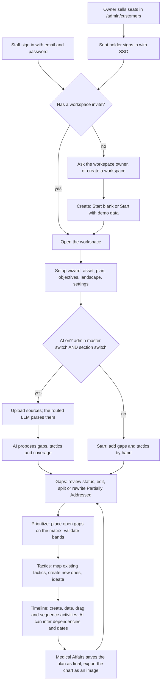

# Application flow — high-level process

This is the **business loop**: how a Medical Affairs consultant and a client team build an Integrated Evidence Generation Plan (IEGP) for one asset. The module-level version is [10-flow-technical.md](./10-flow-technical.md). The engineering process is [05-process.md](./05-process.md).

AI drafts; people decide. Every step has a manual path, and with AI off the whole loop is done by hand.

## What each box means

| Step | What happens | Who decides |
| --- | --- | --- |
| Seats | The owner records each customer, its seats and optional email domains, and assigns seats by email. | Owner, in `/admin/customers`. |
| Sign-in | Customers use SSO and need a seat; staff use a password account. There is no self sign-up. | Identity provider verifies the email; Synapse checks the seat. |
| Workspace | One workspace holds one IEGP. A new one starts blank; demo data only when chosen, with a Demo badge. | Workspace owner. |
| Setup | The plan's context, which prioritization, ideation and the timeline use. | The team. |
| AI switch | An AI section (ingestion, extraction, mapping, split, prioritization, ideation) runs only when the admin's master switch and that section's switch are both on. Customers have no switch. | Synapse admin, in `/admin/control`. |
| Upload | PDF, PPTX, DOCX, XLSX and text files are parsed into blocks by the LLM routed to the parse stage. | Model proposes; people edit blocks. |
| Gaps | Each gap has needs with verbatim quotes. Status is Open, Partially Addressed or Addressed, from recorded coverage or a person's override with a reason. | Model proposes; people validate. |
| Prioritize | Open gaps sit on a two-axis matrix per treatment setting; the quadrant is the band. | Model suggests scores; a person validates the band. |
| Tactics | Existing tactics are mapped with coverage; new tactics are created or ideated for validated open gaps. | Model proposes; people accept, edit or reject. |
| Timeline | Every prioritized gap with its activities beneath it; dated, moved and sequenced by hand, with broken dependencies flagged. With AI on, a rebuild infers dependencies and estimates missing dates; hand values win. | The team; Medical Affairs saves final. |
| Room | A presenter view whose slides are the real pages, with an audience window. **Switched off for now** (`ROOM_ENABLED = false`, KAN-52); `/room` redirects to the plan. | The team. |

## What this loop refuses

- Rules deciding anything an LLM or a person should decide.
- A later AI run overwriting a person's edit.
- Customers signing up by themselves, or signing in without a seat.
- Demo data appearing in a workspace nobody asked for it in.
- A PowerPoint export (removed; the timeline exports as an image).

## Where to look in the app

| You want | Route |
| --- | --- |
| Upload or Start, Gaps, Prioritize, Tactics | `/?place=upload`, `gaps`, `plan`, `tactics` |
| The timeline | `/timeline` |
| Ideas for open gaps | `/ideation` |
| Present | `/room` (switched off for now; redirects to the plan) |
| Workspaces and settings | `/workspaces` |
| Owner console | `/admin` |
