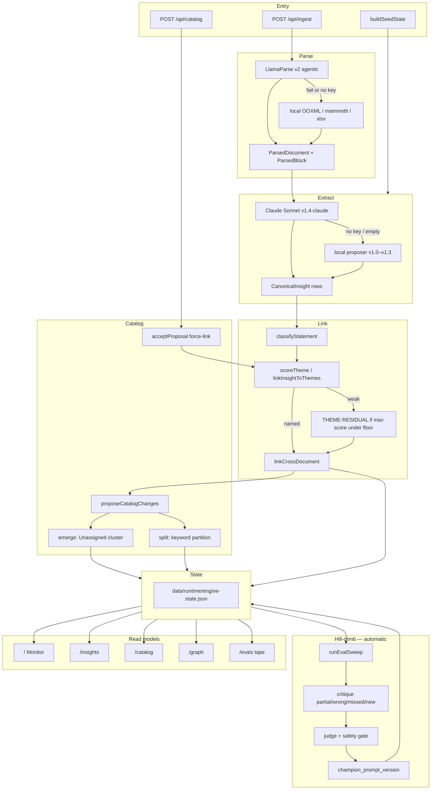

# Application flow — technical

Module, API, and data path for the loop in [09-flow-high-level.md](./09-flow-high-level.md). Engineering process (PRs, CI, Grokbot) remains [05-process.md](./05-process.md).

Runtime is Next.js App Router, Node for zip/xml ingest. System of record is a flat **Canonical Insight Record** plus joins. Nested “document → slides → insights” JSON is not the store.

## Pipeline



## Ingest sequence

```mermaid
sequenceDiagram
  actor Analyst
  participant Ingest as POST /api/ingest
  participant Parse as ingestBuffer
  participant Pipe as ingestParsedDocument
  participant Store as engine-state.json
  participant Eval as runEvalSweep

  Analyst->>Ingest: PPTX / DOCX / XLSX / PDF
  Ingest->>Parse: filename, buffer, mime
  alt LlamaCloud key present
    Parse->>Parse: LlamaParse agentic
  else job fails or no key
    Parse->>Parse: local OOXML
  end
  Parse-->>Ingest: ParsedDocument
  Ingest->>Pipe: addDocument
  Pipe->>Pipe: Claude or local proposeInsights
  Pipe->>Pipe: assignThemes current catalog
  Pipe->>Pipe: proposeCatalogChanges prior proposals
  Pipe->>Eval: extract ladder v1.0–v1.3 vs gold
  Eval-->>Pipe: champion if safety gate holds
  Pipe->>Store: persist EngineState
  Store-->>Analyst: dashboard JSON; UI refreshes
```

Catalog accept is a separate write path: `POST /api/catalog` → `decideCatalogProposal` → `acceptProposal` / `rejectProposal` → persist. Rejected fingerprints are not queued again. Accept appends `catalog[]`, re-runs `assignThemes`, and force-links `proposal.insight_ids` (`method: catalog_accept`). CIR rows are not copied.

## Data contract

```
documents[]  1—n  insights[]  1—n  theme_links[]  n—1  themes[]
                  1—n  knowledge_state.corroborated_by
catalog[]                    catalog_proposals[]
```

| Collection | File / type | Rule |
| --- | --- | --- |
| `documents` | `ParsedDocument` | Source blocks; parser used (`llamaparse` \| `local` \| `seed`). |
| `insights` | `CanonicalInsight` | One claim, one id. `statement` lives only here. |
| `theme_links` | `{ insight_id, theme_id, score, role, method }` | Source of truth for membership. |
| `themes` | derived from catalog + links | IDs and counts only; no copied statements. |
| `catalog` | `CatalogTheme` | Append-only ontology. `parent_theme_id` on splits. |
| `catalog_proposals` | emerge \| split | `proposed` / `accepted` / `rejected`. |
| `gold` / `eval_runs` | gold + tape | Evals key CIR ids, not theme names. |

Graph revelations (`blend`, `bridge`, `gap_closure`) are **computed** in `src/lib/graph/connections.ts` on read. They are not a persisted table.

## Code map

| Concern | Path |
| --- | --- |
| HTTP ingest | `src/app/api/ingest/route.ts` |
| Parse | `src/lib/ingest/llamaparse.ts`, `local-parse.ts` |
| Extract | `src/lib/extract/proposer.ts`, `claude-proposer.ts` |
| Classify | `src/lib/extract/classify.ts` |
| Theme score + joins | `src/lib/cluster/cluster.ts` |
| Emerge / split / accept | `src/lib/cluster/catalog-evolution.ts` |
| Orchestration | `src/lib/pipeline.ts` |
| Persistence | `src/lib/store.ts` |
| Graph | `src/lib/graph/connections.ts` |
| Eval ladder | `src/lib/eval/critique.ts`, `judge.ts` — protocol [06-eval-protocol.md](./06-eval-protocol.md), inventory [12-gold-set.md](./12-gold-set.md) |
| Schema | `src/lib/schema.ts` |

## Surfaces

| Route | Reads | Writes |
| --- | --- | --- |
| `/` | themes + `summarizeTheme` | none |
| `/insights` | CIR + filters | none |
| `/catalog` | catalog + proposals | `POST /api/catalog` |
| `/graph` | `buildKnowledgeGraph(state)` | none |
| `/ingest` | provider status | `POST /api/ingest` |
| `/evals` | `eval_runs` | none (hill-climb is on seed/ingest) |
| `/sdlc` | `docs/sdlc/*` | none |

## Thresholds the diagrams hide

| Gate | Value | Module |
| --- | --- | --- |
| Named-theme primary floor | 0.45 | `cluster.ts` |
| Secondary link | score ≥ 0.9 and ≥ 48% of primary, cap 4 | `cluster.ts` |
| Cross-document corroboration | statement similarity ≥ 0.52 | `cluster.ts` |
| Emerge | ≥ 2 Unassigned CIR, cohesion ≥ 0.34 | `catalog-evolution.ts` |
| Split | named theme ≥ 4 CIR; exclusive keyword sets ≥ 2 | `catalog-evolution.ts` |
| Exact gold pair | statement similarity ≥ 0.58 | `critique.ts` |
| Partial gold pair | ≥ 0.32 | `critique.ts` |
| Grounding (new vs wrong) | ≥ 0.28 | `critique.ts` / `proposer.ts` |
| Promote composite delta | ≥ +0.01 and Δwrong ≤ +0.05; must-find recall drop ≤ 0.02 | `judge.ts` |

Hill-climb always uses the **local** v1.0–v1.3 ladder so scores do not wobble when Claude is on for live extract.
