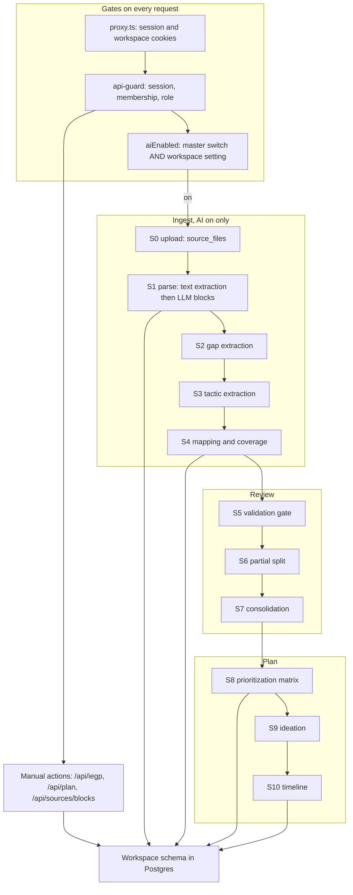
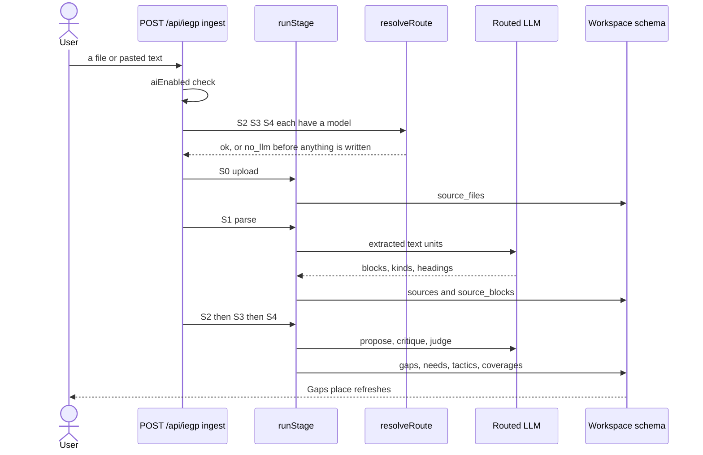

# Application flow — technical

Module, API and data path for the loop in [09-flow-high-level.md](./09-flow-high-level.md). Architecture: [02-architecture.md](./02-architecture.md). Stage contracts: [../modules.md](../modules.md).

## Stages

```mermaid
flowchart TB
  subgraph gate["Gates on every request"]
    proxy["proxy.ts: session and workspace cookies"]
    guard["api-guard: session, membership, role"]
    aisw["aiEnabled: master switch AND workspace setting"]
  end

  subgraph ingest["Ingest, AI on only"]
    s0["S0 upload: source_files"]
    s1["S1 parse: text extraction then LLM blocks"]
    s2["S2 gap extraction"]
    s3["S3 tactic extraction"]
    s4["S4 mapping and coverage"]
  end

  subgraph review["Review"]
    s5["S5 validation gate"]
    s6["S6 partial split"]
    s7["S7 consolidation"]
  end

  subgraph plan["Plan"]
    s8["S8 prioritization matrix"]
    s9["S9 ideation"]
    s10["S10 timeline"]
  end

  manual["Manual actions: /api/iegp, /api/plan, /api/sources/blocks"]
  store["Workspace schema in Postgres"]

  proxy --> guard --> aisw
  aisw -->|on| s0
  s0 --> s1 --> s2 --> s3 --> s4 --> s5
  s5 --> s6 --> s7 --> s8 --> s9 --> s10
  guard --> manual
  manual --> store
  s1 --> store
  s4 --> store
  s8 --> store
  s10 --> store
```

S2, S3, S4, S6, S8 and S9 are agentic: a proposer, three critic exchanges, then a judge, on the model routed to the stage. S1 parse is an LLM stage too. With no model connected a stage fails with `no_llm`; with AI off it throws `AiDisabledError`. The manual actions never need a model.

## Ingest sequence

```mermaid
sequenceDiagram
  actor User
  participant API as POST /api/iegp ingest
  participant Kernel as runStage
  participant Route as resolveRoute
  participant LLM as Routed LLM
  participant DB as Workspace schema

  User->>API: a file or pasted text
  API->>API: aiEnabled check
  API->>Route: S2 S3 S4 each have a model
  Route-->>API: ok, or no_llm before anything is written
  API->>Kernel: S0 upload
  Kernel->>DB: source_files
  API->>Kernel: S1 parse
  Kernel->>LLM: extracted text units
  LLM-->>Kernel: blocks, kinds, headings
  Kernel->>DB: sources and source_blocks
  API->>Kernel: S2 then S3 then S4
  Kernel->>LLM: propose, critique, judge
  Kernel->>DB: gaps, needs, tactics, coverages
  DB-->>User: Gaps place refreshes
```

## Timeline by hand

The timeline API (`POST /api/plan`) takes `create_activity`, `add_activity`, `move_activity`, `remove_activity` and `set_dependencies` with no stage run and no model; each write is an edit record with the signed-in actor, and viewers are refused. An S10 run keeps every hand edit. `save_plan` stores a draft or, for Medical Affairs, a final version in `iegp_plans`. The chart is exported client-side as a PNG.

## Data contract

| Table (per workspace schema) | What |
| --- | --- |
| `source_files`, `sources`, `source_blocks` | Uploaded files and their parsed blocks |
| gaps, needs, tactics, coverages, residuals | The IEGP domain (`src/lib/iegp/schema.ts`) |
| `priority_axes`, `priority_placements` | S8 matrix configuration and placements |
| `ideation_proposals` | S9 ideas, AI or by hand |
| `timeline_activities`, `iegp_plans` | S10 activities and saved versions |
| `edit_records`, audit | Every edit with its rationale, before and after, and actor |

Shared tables: `workspaces` (with `ai_enabled`, `demo`), `workspace_members`, `user_accounts`, `customers`, `seat_assignments`, `platform_settings` (the AI master switch).

## Code map

| Concern | Path |
| --- | --- |
| Request gate | `src/proxy.ts`, `src/modules/auth/gate.ts`, `src/modules/auth/api-guard.ts` |
| Sign-in and seats | `src/modules/auth/idp.ts`, `session.ts`, `customers.ts`, `accounts.ts`, `password-login.ts` |
| Workspaces, blank and demo | `src/modules/workspaces/store.ts`, `contents.ts`, `ai-setting.ts` |
| AI switch | `src/modules/kernel/ai-switch.ts` |
| Stage runner and routing | `src/modules/kernel/run.ts`, `routing.ts`, `agentic.ts` |
| Parsing | `src/lib/ingest/local-parse.ts`, `llm-structure.ts`, `src/modules/stages/s1-parse/` |
| Ingest sequencing | `src/app/api/iegp/ingest-pipeline.ts` |
| Domain store and status rules | `src/lib/iegp/store.ts`, `engine.ts` |
| Timeline | `src/modules/stages/s10-timeline/`, `src/components/timeline/` |

## Surfaces

| Route | Reads | Writes |
| --- | --- | --- |
| `/` | domain state for the open workspace | `/api/iegp`, `/api/modules` |
| `/sources` | sources and blocks | `/api/iegp` ingest, `/api/sources/blocks` |
| `/ideation` | `ideation_proposals` | `/api/plan` |
| `/timeline` | timeline model and plan history | `/api/plan` |
| `/room`, `/room/audience` | room state | `/api/room` |
| `/workspaces/[id]` | workspace, members, AI setting | `/api/workspaces/[id]`, `/members`, `/ai`; `/api/iegp` `load_demo` and `reset` |
| `/admin/*` | owner console | `/api/admin/*`, `/api/control`, `/api/accuracy/*` |
