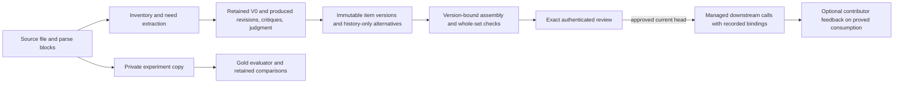

# KAN-4 accuracy-first agent loop: implemented design review

**Status (KAN-43 review, 2026-10-06):** KAN-31–KAN-42 have source and test implementations in this checkout. This is a code-level review, not evidence that migrations ran in a deployed environment, that these commits reached a remote branch, or that a live customer proposal completed the entire flow. The original KAN-30 text was prospective; [the KAN-43 evidence record](../../kan-43-pipeline-review.md) distinguishes implemented contracts from observed runs.

**Scope:** The call-kind accuracy pipeline under `src/accuracy/`; the legacy S0–S10 pipeline under `src/modules/` has different behavior. Background: [KAN-4 domain model](../../kan-4-domain-model.md) and [ADR 0001](../../adr/0001-kan4-mixed-iteration-selection.md). Historical decisions in those drafts do not override the code behavior below.

## Current flow and boundaries

`runShallowAgenticCycle` in `src/accuracy/kernel/agentic.ts` defaults to one critic/revision opportunity. It records a snapshot for V0 and each produced revision, a critique and completeness assessment for each version (including the terminal version), and a judgment event with metering. Production may exit early after a clean high-scoring critique. Controlled experiment conditions use one, two, or three passes and disable that early exit. The judge still chooses the **latest produced version** (`selected_iteration`); it does not compare earlier admissible versions and choose the strongest one. The proposer also acts as reviser. Critic and judge remain distinct roles.

`src/accuracy/modules/completeness-audit/snapshot-inspector.ts` checks auditable source blocks against current items and validates quoted omission evidence. A citation to one block does not imply that every distinct item in that block was found. Explicit important omissions become high-severity critic feedback; inferred possibilities stay advisory. The extraction batch may pause before downstream progression when important omissions remain; review and resume use a durable journal and reserved run identities. A failed completeness check remains a failed or unknown check rather than a clean result. See `src/accuracy/kernel/omission-pause.ts` and `src/app/api/accuracy/extract/route.ts`.

The extraction result is published as draft claims and immutable `accuracy_item_versions`. A version records source file, extraction run, snapshot/iteration where one exists, item index, exact payload and provenance. The judged final may have no matching snapshot, which the UI labels explicitly. Alternatives kept only for review are not downstream eligible. Unique exact source-backed matches may share an item identity; uncertain same-item, split and merge ancestry requires an authenticated contributor decision with a reason. See `src/accuracy/store/item-history-store.ts` and [KAN-36](../../kan-36-item-history.md).

`generateExtractionAssembly` selects persisted judged versions, runs coverage for exact selected gap/tactic version pairs, and saves an immutable assembly. Each selection has a reason. `checkAssembly` validates the whole set, including payload schemas, source scope and verbatim provenance, duplicates, mappings, coverage inputs and linking state. Its fingerprint covers selected versions, mappings, coverage, extraction lineage and completion state. A passed deterministic check establishes those invariants only; it does not establish clinical correctness or recall. See `src/accuracy/kernel/assembly-generation.ts`, `src/accuracy/domain/assembly.ts`, and [KAN-37](../../kan-37-mixed-assembly.md).

An authenticated contributor or Medical Affairs reviewer may approve or reject the exact current assembly with a rationale. A blocking check prevents approval; every advisory requires a reasoned override. Review stores both assembly and check fingerprints and reviewer identity. A rejection or newer applied extraction pauses managed live use without reverting to an older approval. Human add/edit/remove actions create successor versions and assemblies with author, reason and predecessor lineage; they require fresh checks and approval. Failed linking is retained for controlled retry, not silently treated as complete. See `src/accuracy/domain/assembly-review.ts`, `src/accuracy/store/assembly-review-store.ts`, [KAN-38](../../kan-38-assembly-approval.md), and [KAN-39](../../kan-39-human-revisions.md).

Managed production readers and module execution resolve the approved projection. `runAccuracyModule` records `assembly:approved-live-bindings` and revalidates the binding before publication; explicit IDs and caller-supplied payloads cannot bypass exact content checks. Internal preparation and isolated experiment scopes are separate. `src/accuracy/store/assembly-feedback-store.ts` accepts contributor observations only after proving a successful production consumer run has a matching historical approval, assembly fingerprint, extraction ownership and selected item versions. This operational feedback never becomes a gold score. See [KAN-42](../../kan-42-production-feedback.md).

## Evaluation contexts

**Production without gold:** Snapshot signals cover quote validity, structural and domain findings, completeness risk, issue fate where assessable, latency, token usage and estimated cost. Review and feedback are human operational observations. These signals are useful for triage but cannot be called precision, recall, F1 or clinical accuracy.

**Isolated experiment with curated gold:** `copyExperimentWorkspace` creates a private copy of the selected source and baseline, with remapped identifiers and source/baseline fingerprints. Gold answers enter evaluator code only, never the generator, copied workspace, request body, production event or production score. The versioned evaluator scores `need_extract` and `inventory_extract` source items; unsupported downstream dimensions remain unscored. Failed attempts retain available evidence. [KAN-34](../../kan-34-experiments.md) defines the evaluator and isolation contract.

**Pass comparison:** One-, two-, and three-pass cohorts run in independent copies. A matched comparison requires the same original source, baseline, pack/evaluator, original request and actual module/route identities. Incomplete attempts, invalid support or missing evidence cannot win. Ranking prefers distinct exact must-find recovery, then other exact source recovery, fewer wrong/partial outcomes, lower measured cost/latency and fewer passes. A recommendation is an experiment result, not production promotion. See [KAN-35](../../kan-35-pass-comparisons.md).

**Mixed downstream comparison:** Two explicitly nominated original assemblies are replayed in separate private copies without rerunning extraction. The fixed automatic gate `deterministic_checks_pass_no_edits_v1` blocks on deterministic findings and records advisories without human edits. Replay retains selected/generated lineage, stage calls, gates and final outputs through coverage, validation, splitting, status, priority, ideation and Gantt where applicable. Only curated source gaps and inventory tactics have gold outcomes; downstream quality is explicitly unscored. See [KAN-40](../../kan-40-mixed-pipeline-benchmark.md). [KAN-41](../../kan-41-experiment-results.md) exposes retained evidence and limited labels: one matched safe gain is observed, while consistent improvement requires separately retained complete matched repeats.

## Historical proposal versus current implementation

The KAN-30 example of a regional comparator gap omitted in V0, added in V1 and losing its citation in V3 was an **illustration**, not an observed run. The implemented loop retains produced versions and issue evidence. However, its latest-version judgment cannot choose the earlier supported V1 in that example. A human can later revise an assembly, and an experiment can compare pass counts, but those are separate actions. The original aspiration for a judge to select any earlier admissible version remains a design gap.

The original proposal also called for a complete, source-to-consumer evidence chain. Current code stores the necessary pieces and tests their contracts. The available test chain in [the KAN-43 record](../../kan-43-pipeline-review.md) uses controlled fixture data; it does not establish that one live customer gap has been observed through all stages. Deployment migration state, remote integration and actual model quality still need separate evidence.

## Remaining decisions

- Decide whether and how judgment should select an earlier admissible version; retain a reason and ensure publication, assembly selection and evaluation agree on that choice.
- Run and retain a real provider experiment with specified source and gold identities before changing production pass depth. Separately retained repeats are needed for a consistency claim.
- Establish deployed migration and remote integration evidence, then inspect an authorized production run's actual item-version, approval and consumption lineage before claiming the complete path operates live.
- Keep downstream dimensions unscored until curated reference labels and a versioned evaluator exist. Do not promote production feedback or deterministic gate success into an accuracy score.
